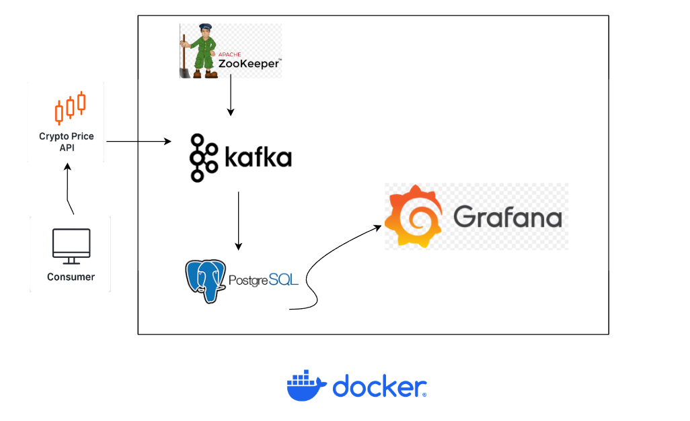
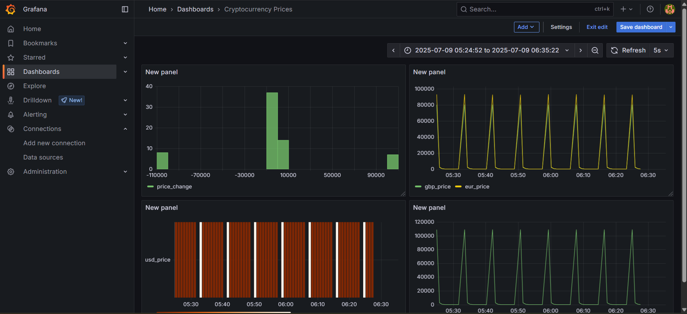

# Real-Time Cryptocurrency Price Monitoring with Kafka, PostgreSQL, and Grafana

## Project Overview

This project demonstrates a real-time streaming pipeline that fetches live cryptocurrency prices for 10 popular cryptocurrencies, processes the data via Apache Kafka, stores the data in PostgreSQL, and visualizes the results on Grafana dashboards. The entire setup is containerized using Docker Compose.

---

## Technologies Used

- **Apache Kafka (Confluent Platform)**
- **Apache ZooKeeper**
- **PostgreSQL**
- **Debezium (Optional for CDC)**
- **Python (Producer & Consumer)**
- **Grafana**
- **Docker & Docker Compose**

---

## Architecture Diagram


<p align="center">
  
</p>


---

## Cryptocurrencies Tracked

- Bitcoin (BTC)
- Ethereum (ETH)
- Binance Coin (BNB)
- Ripple (XRP)
- Cardano (ADA)
- Dogecoin (DOGE)
- Solana (SOL)
- Polkadot (DOT)
- Litecoin (LTC)
- Polygon (MATIC)

Each currency has its own Kafka topic: `crypto.btc`, `crypto.eth`, etc.

---

## Database Schema

PostgreSQL Database: `bitcoin`

Table: `crypto_prices`

| Column     | Type          |
|-----------|---------------|
| id        | SERIAL (PK)   |
| symbol    | VARCHAR(20)   |
| timestamp | TIMESTAMP     |
| usd_price | FLOAT         |
| gbp_price | FLOAT         |
| eur_price | FLOAT         |
| inr_price | FLOAT         |

---

## How It Works

1. **Producer (`producer.py`)**
   - Fetches real-time cryptocurrency prices from public API (CoinGecko or similar).
   - Publishes the prices to individual Kafka topics.

2. **Kafka Broker & ZooKeeper**
   - Manages messaging queues.

3. **Consumer (`consumer.py`)**
   - Consumes messages from Kafka topics.
   - Writes the data into PostgreSQL tables.

4. **Grafana**
   - Visualizes real-time crypto price trends using:
     - Time series line graphs
     - Bar charts
     - Single stat panels

---

## Queries Used in Grafana

### 1. Time Series for All Prices:
```sql
SELECT
  timestamp AS "time",
  usd_price,
  gbp_price,
  eur_price,
  inr_price
FROM
  crypto_prices
WHERE
  usd_price > 0
ORDER BY
  timestamp ASC;
```

### 2. GBP vs EUR Comparison:
```sql
SELECT
  timestamp AS "time",
  gbp_price,
  eur_price
FROM
  crypto_prices
WHERE
  gbp_price > 0 AND eur_price > 0
ORDER BY
  timestamp ASC;
```

### 3. Max Prices Panel:
```sql
SELECT
  MAX(usd_price) AS usd_price,
  MAX(gbp_price) AS gbp_price,
  MAX(eur_price) AS eur_price,
  MAX(inr_price) AS inr_price
FROM
  crypto_prices;
```

### 4. Heatmap (Optional):
- Not directly supported with this data but could be emulated using transformations.

### 5. Pie Chart (Alternative Visualization):
- Visualize last recorded prices of multiple currencies as percentages.

---

<h2 style="text-align: center;">Grafana Dashboard</h2>
<p align="center">
  
</p>

## Docker Compose Overview

- Services:
  - `zookeeper`
  - `kafka`
  - `postgres`
  - `debezium` (optional)
  - `grafana`

---

## Key Takeaways

✅ Real-time streaming data pipeline  
✅ Hands-on Kafka topic management  
✅ Time-series storage in PostgreSQL  
✅ Dashboarding and visualization in Grafana  
✅ End-to-end containerized environment

---

## Future Improvements

- Add more crypto assets.
- Implement better aggregation for minute/hour level metrics.
- Use Debezium for Change Data Capture (CDC) for better database streaming.
- Deploy on Kubernetes.

---

## How to Run

1. Start Docker Compose:
```bash
docker-compose up -d
```

2. Run Producer:
```bash
python producer.py
```

3. Run Consumer:
```bash
python consumer.py
```

4. Access Grafana:
```
http://localhost:3000
```

---

## Author
Karthik Bommineni

---

Feel free to fork, star ⭐, and improve this repository!
